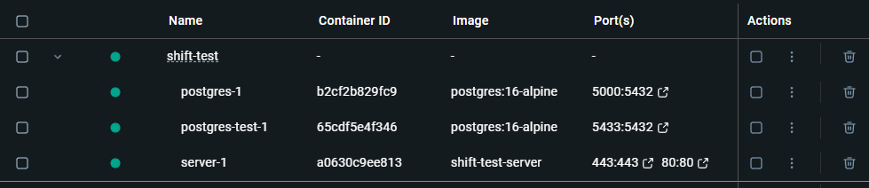
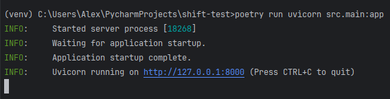
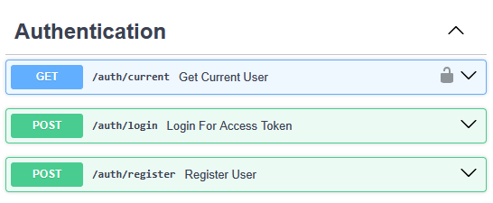
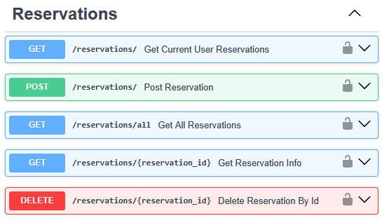
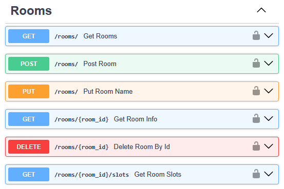
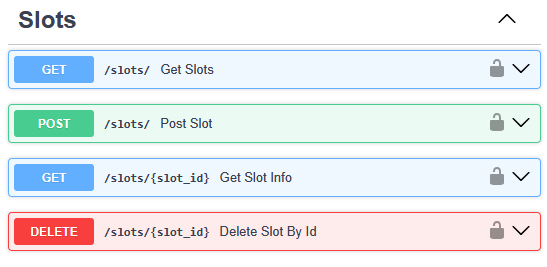
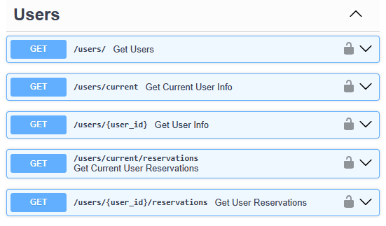
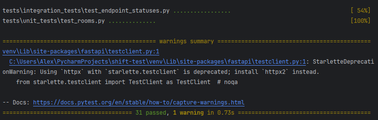

# Описание
Веб-сервис для автоматизации бронирования переговорных комнат в коворкингах. Комнаты имеют заранее определенные временные слоты для записи.

Сотрудники могут:
- Просматривать доступные комнаты
- Просматривать доступные слоты комнат
- Создавать бронирование на незанятые слоты комнат
- Просматривать собственные бронирования
- Удалять собственные бронирования

Администраторы могут в дополнение к возможностям обычных сотрудников:
- Создавать комнаты
- Создавать временные слоты для комнат
- Просматривать бронирования любых пользователей
- Удалять бронирования любых пользователей

Веб-сервис реализует HTTP-методы (REST) для выполнения действий пользователями. 

Аутентификация реализуется с помощью OAuth2 и JWT-токенов с ограниченным сроком действия.

Приложение контейнеризовано с помощью Docker, создан docker-compose.yml для запуска FastAPI сервера и БД.

## Стек
- Python 3.11
- FastAPI - веб-фреймворк
- PostgreSQL - база данных
- SQLAlchemy + Pydantic - ОРМ
- Poetry - управление зависимостями
- Docker - контейнеризация
- Pytest - тестирование
- OAuth2 - аутентификация пользователей

# Запуск сервиса
### Подключение к базе данных
На данный момент реализован только один способ работы с данными:
- База данных PostgreSQL (требуется поднять контейнер БД ```postgres``` через ```docker-compose.yml```)

За выбор режима, в котором будет запускаться приложение отвечает переменная ```DB_MODE``` в файле ```.env``` и в переменных контейнера "server" ```docker-compose.yaml```. 

Для работы с **PostgreSQL** необходимо установить значение переменной ```DB_MODE=postgres```. 
(Рассчитано на запуск приложения через docker-compose, но также будет работать, если отдельно поднять контейнер postgres.)

В дальнейшем планируется добавить использование **JSON** файла в качестве базы данных (```DB_MODE=file```), это позволит запустить приложение полностью через Uvicorn, не используя Docker.

**На данный момент** приложение корректно запускается в обоих режимах (postgres/file), но FastAPI эндпоинты корректно работают только при использовании контейнера PostgreSQL в качестве БД.

## С помощью контейнеров Docker
1) После копирования репозитория проекта в файле переменных окружения в docker-compose.yml необходимо выбрать режим работы базы данных (```DB_MODE=postgres``` в docker-compose.yml).
2) Далее необходимо выполнить команду ```docker compose up --build``` из корня репозитория.



В файле docker-compose.yaml описаны следующие контейнеры:
- **"server"** - FastAPI сервер приложения
- **"postgres"** - основная база данных PostgreSQL
- **"postgres-test"** - база данных PostgreSQL для тестирования

Для инициализации демонстрационных данных в БД используется Alembic - созданы скрипты создания таблиц и добавления данных.

## С помощью Uvicorn
1) После копирования репозитория проекта в файле ```.env``` необходимо выбрать режим работы базы данных (```DB_MODE=file```/```DB_MODE=postgres```).
   - Если выбран режим ```DB_MODE=postgres```, необходимо поднять контейнер с БД ```postgres``` с помощью ```docker-compose.yml```.
2) Далее необходимо выполнить команду ```poetry run uvicorn src.main:app``` из корня репозитория.



# Описание эндпоинтов
Необходимые методы для пользователей и администраторов реализованы в формате эндпоинтов FastAPI. 

Для каждой из сущностей БД создан отдельный роутер с CRUD набором методов (+ роутер для аутентификации).

Использовать все методы, кроме регистрации и авторизации, могут только **авторизованные** пользователи - предусмотрен возврат кода ошибки 401 (Unauthorized) при отсутствии корректного токена авторизации.

В эндпоинтах предусмотрена **проверка пользовательских прав** - только администраторы могут выполнять некоторые действия (например удалять чужие бронирования или создавать комнаты). Если у пользователя нет прав выполнять запрос к определенным эндпоинтам - предусмотрен возврат кода ошибки 404 (Not found) или 403 (Forbidden).

### Аутентификация (auth)


- **[GET /auth/current]** - получение информации о текущем пользователе для проверки корректности авторизации 
  - Возвращает: имя пользователя, есть ли права администратора
- **[POST /auth/login]** - получение токена авторизации для зарегистрированного пользователя 
  - Возвращает: токен авторизации
- **[POST /auth/register]** - регистрация нового пользователя и получение токена авторизации 
  - Возвращает: токен авторизации

### Бронирования (reservations)


- **[GET /reservations/]** - получение бронирований текущего пользователя для просмотра 
  - Возвращает: id всех бронирований
- **[POST /reservations/]** - создание бронирования для текущего пользователя по id слота 
  - Принимает: id слота
  - Возвращает: id бронирования
- **[GET /reservations/all]** - получение бронирований всех пользователей
  - Для администратора
  - Возвращает: id всех бронирований и id владельцев
- **[GET /reservations/{reservation_id}]** - просмотр информации о конкретном бронировании
  - Администратор просматривает любые, пользователь только свои
  - Возвращает: имя владельца, название комнаты, дату и время слота
- **[DELETE /reservations/{reservation_id}]** - удаление бронирования по id
  - Для администратора

### Комнаты (rooms)


- **[GET /rooms/]** - получение информации о доступных комнатах
  - Возвращает: названия и id всех комнат
- **[POST /rooms/]** - создание комнаты
  - Для администратора
  - Принимает: название для новой комнаты
  - Возвращает: id и название новой комнаты
- **[PUT /rooms/]** - изменение названия существующей комнаты
  - Для администратора
  - Принимает: название для новой комнаты
  - Возвращает: id и новое название комнаты
- **[GET /rooms/{room_id}]** - просмотр информации комнаты
  - Возвращает: id и название комнаты
- **[DELETE /rooms/{room_id}]** - удаление комнаты по id (с каскадным удалением слотов и бронирований комнаты)
  - Для администратора
- **[GET /rooms/{room_id}/slots]** - просмотр слотов комнаты по id
  - Возвращает: id и название комнаты, время начала, конца и дату каждого слота комнаты

### Слоты (slots)


- **[GET /slots/]** - просмотр всех доступных слотов во всех комнатах для выбора удобного
  - Возвращает: id слота, id комнаты, время начала, конца и дату слота
- **[POST /slots/]** - создание слота для комнаты
  - Для администратора
  - Принимает: id комнаты, время начала, конца и дату слота
  - Возвращает: id созданного слота, id комнаты, его время начала, конца и дату
- **[GET /slots/{slot_id}]** - просмотр информации слота по id
  - Возвращает: id слота, id и название комнаты, время начала, конца и дату слота
- **[DELETE /slots/{slot_id}]** - удаление слота по id (с каскадным удалением бронирований этого слота)
  - Для администратора


### Пользователи (users)


- **[GET /users/]** - просмотр информации о всех пользователях
  - Для администратора
  - Возвращает: имя и права для каждого пользователя
- **[GET /users/current]** - просмотр информации о текущем авторизованном пользователе
  - Возвращает: имя и права пользователя
- **[GET /users/{user_id}]** - просмотр информации о конкретном пользователе по id
  - Для администратора
  - Возвращает: имя и права пользователя
- **[GET /users/current/reservations]** - просмотр бронирований текущего авторизованного пользователя
  - Возвращает: id пользователя, id бронирования, id слота
- **[GET /users/{user_id}/reservations]** - просмотр бронирований любого пользователя
  - Для администратора
  - Возвращает: id пользователя, id бронирования, id слота


# Детали разработки
### SQLalchemy модели, Pydantic схемы
Для разделения логики созданы схемы **Pydantic** (используются эндпоинтами FastAPI для принятия и возврата информации об объектах для пользователей) и модели **SQLAlchemy** (для работы SQLAlchemy репозиториев с данными в PostgreSQL).


### Паттерн репозиториев
Для удобства замены баз данных во время разработки приложения используется паттерн репозиториев, для каждого объекта данных (Пользователь, Комната, Слот, Бронирование) создан отдельный набор репозиториев.

Базовый репозиторий возвращает объекты Pydantic схемы, используемые в качестве базовых моделей репозитория.

На основе базового репозитория созданы два других:
- Для работы с SQLAlchemy, возвращаемые ORM модели реализуют базовые модели с таким же набором полей, но специфичные для БД.
- Для работы с JSON файлом, возвращаются Pydantic модели (пока не реализовано)

### Авторизация пользователей и права доступа
Авторизация и аутентификация пользователей реализована средствами OAuth2.

Метод ```src.modules.auth.router.get_user``` выполняет проверку, что пользователь с таким логином существует в БД.

Метод ```src.modules.auth.router.authenticate_user``` проверяет, что пользователь указал правильный пароль.

Если пользователь не был найден в БД или пароль указан неправильный - выдается одинаковая ошибка "Введен неверный логин или пароль", чтобы не было понятно, какие логины существуют в базе, а какие нет.

Для проверки авторизации в эндпоинтах используются ```Annotated[users_schema.User, Depends(get_current_user)]``` и ```dependencies=[Depends(get_current_user)]```.

# Тестирование
Для тестирования используется библиотека **Pytest**.

Реализованы юнит-тесты для модуля комнат (Room), а также часть интеграционных тестов, проверяющая коды ответа запросов пользователей к эндпоинтам сервиса.

**Юнит-тесты** реализованы с использованием искусственных репозиториев с искусственными данными, для проверки работы методов FastAPI отдельно от остальных функций приложения (включая функции репозиториев данных).

Для **интеграционного тестирования** создан отдельный Docker контейнер с тестовой базой данных - при запуске происходит инициализация таблиц и тестовых данных, при завершении тестирования все данные удаляются.



# Перспективы развития проекта
При дальнейшей разработке проекта планируется:
- Добавить юнит-тесты для остальных модулей (пользователи, слоты, бронирования) аналогично существующим
- Добавить интеграционные тесты для оставшихся эндпоинтов и кодов ошибок
- Добавить использование scope токена для проверки прав доступа пользователей вместо поля is_admin в модели
- Расширить набор методов для пользователей (создание пользователей с правами администратора/без, удаление пользователей)
